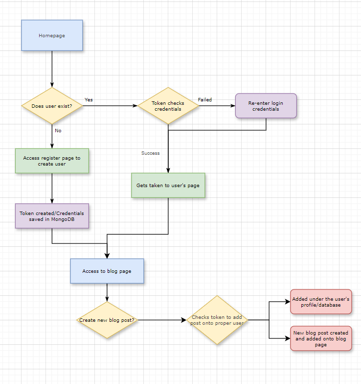

# blogger-platform

### Flowchart

As seen in the flowchart, the idea is to implement a login/register form system to ensure that every user in the blogger platform, whether it be to create their own blog posts, to view other users' blog posts, or to access their account, they will be able to do that.

- It will have jsonwebtoken with express to verify everytime a user logs into the platform.
- If it doesn't exist, the application will direct it to the register page, where once the user enters the proper credentials, it will create a token to be stored in localStorage and then the information entered will be sent to MongoDB and create a folder for the user to store blog posts.

This is the minimum of the project at the moment. There will be details such as what was implemented, my thought process in completing this project, and also my reflection after completing it included. Please stay tune for more!!!